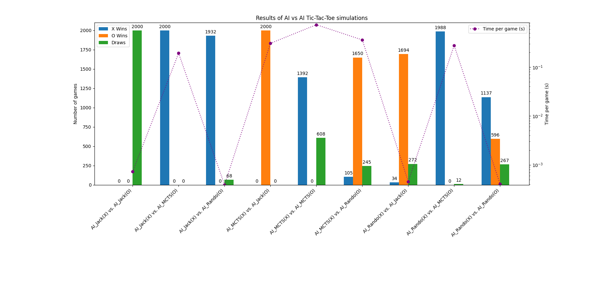

## Tic Tac Toe Game, itteration 4

# An exploration of game algorithms in Tic Tac Toe 

1. __Demo__ the Tic Tac Toe game using the console:

    _python main.py_ - 
        A menu will prompt you to choose an opponent (or select an AI vs AI pairing).
        quit at any prompt by entering 'q'.

2. Run some __simulations__, pitting AI's against each other:

    _python simulate.py_ -
        You will prompted for a number of episodes (max 10k), and to assign the
        X and O players from a selection of available AI players. The simulation
        results are tabulated in 'results.json'

    _python presenter.py_ - make the 'results.json' human-friendly (print to console)

    _python plotter.py_ - graph the 'results.json' for visual analysis of different

3. Run simulation-batches with sim_runner.py or it's BatchRunner class/

4. __Other__ helper modules:

    _players.py_ - 
        Where the AI's live; _lots of room to grow._

_Graph displaying relative AI performance in play strategy and efficiency (time taken) showing the 
results of each AI vs AI pairing. Wins, losses, draws, and time to complete are ranked for each pairing._